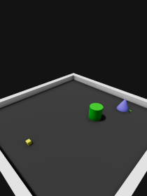
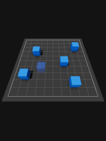
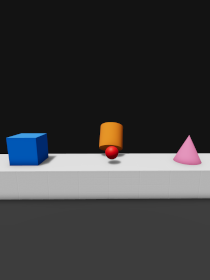
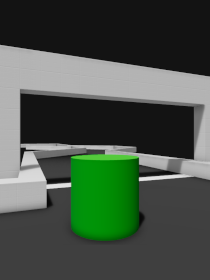
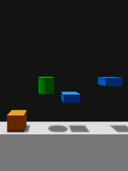
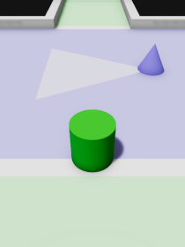
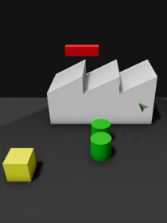
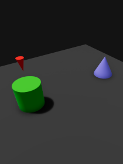
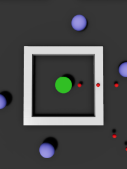

# Minimal Game Templates for O3DE

This is a collection of templates that tries to introduce the basic fundamentals of game development using [O3DE (Open 3D Engine)](https://www.o3de.org). Each template is focused on a specific game genre, implementing some of its most important core mechanics in the simplest and most understandable way as possible.

No assets, graphical interface, or audio/visual effects are contained in the templates. There is just the base architecture of the project with some entry-level scripts for the gameplay. When you get comfortable with them, you are encouraged to try experimenting on your own to create new gameplay features, to enhance the final look, to optimize the code, and so on!

| [Action RPG](https://github.com/matteogrs/templates.o3de.minimal.action-rpg) | [Builder](https://github.com/matteogrs/templates.o3de.minimal.builder) | [First-Person Shooter](https://github.com/matteogrs/templates.o3de.minimal.first-shooter) | [Kart Racing](https://github.com/matteogrs/templates.o3de.minimal.kart-racing) | [Platformer](https://github.com/matteogrs/templates.o3de.minimal.platformer) |
| :---: | :---: | :---: | :---: | :---: |
|  |  |  |  |  |

| [Puzzle](https://github.com/matteogrs/templates.o3de.minimal.puzzle) | [Stealth](https://github.com/matteogrs/templates.o3de.minimal.stealth) | [Real-Time Strategy](https://github.com/matteogrs/templates.o3de.minimal.strategy) | [Turn-Based Tactics](https://github.com/matteogrs/templates.o3de.minimal.tactics) | [Twin-Stick Shooter](https://github.com/matteogrs/templates.o3de.minimal.twinstick-shooter) |
| :---: | :---: | :---: | :---: | :---: |
|  |  |  |  |  |

## License
**Minimal Game Templates for O3DE** were created by [@matteogrs](https://github.com/matteogrs). Please refer to the dedicated repositories for further details about the license terms of each template in the collection.
